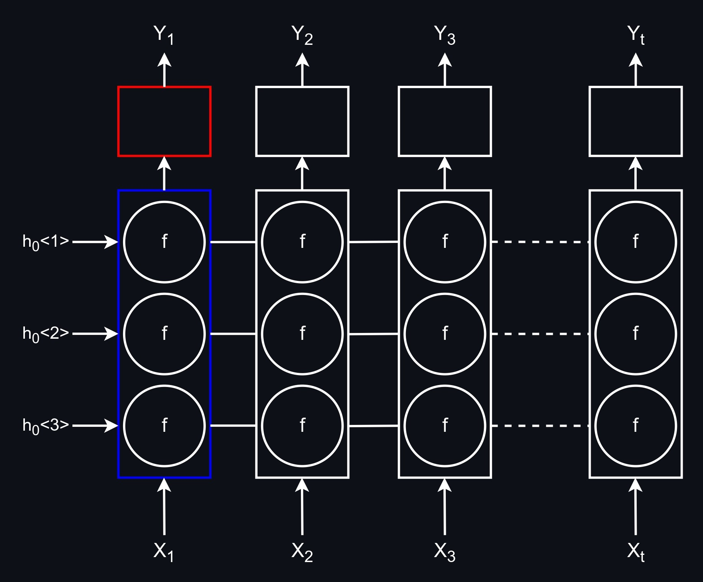
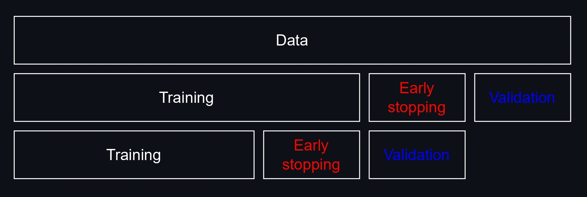
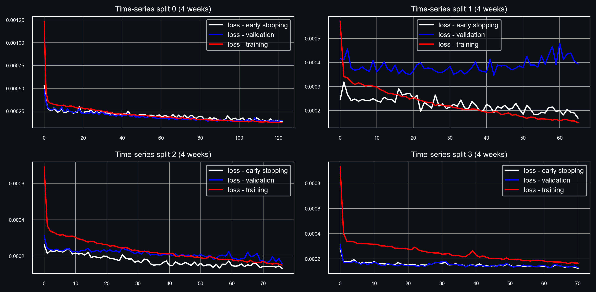
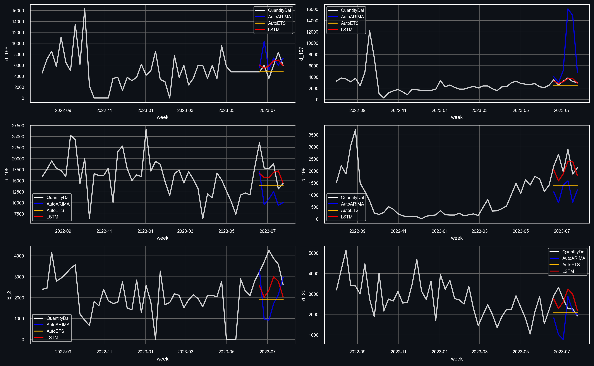

<div align="center">
  <h1>Long short-term memory neural network</h1>
  
  <picture>
  <source media="(prefers-color-scheme: dark)" srcset="analysis/RNN_dark.jpg">
  <source media="(prefers-color-scheme: light)" srcset="analysis/RNN_light.jpg">
  
  </picture>
</div>

# <a name="s1"/> About the project

## <a name="s1.1"/> 1. Goal

Use an $LSTM$ neural network to model highly volatile sequential data with a hierarchical structure.

## <a name="s1.2"/> 2. Data description

For this project, real-world data of beer consumption in Russia were used. All data were anonimised and modified; permission was given to share data for educational purposes. The dataset consists of 650 weekly time series and has over 88,000 observations. A different dataset was used for the following project: 
[time-series forecasting with gradient boosting](https://github.com/ghginm/Time-series-forecasting-with-Gradient-Boosting).

## <a name="s1.3"/> 3. Project structure

```
├── LSTM/
|   ├── analysis/
│   ├── data/
│   ├── model/
│   │   ├── epoch.pickle
|   |   ├── final_model_0_param_avg.pt
|   |   ├── final_model_1_param_avg.pt
|   |   ├── final_model_2_param_avg.pt
│   │   ├── final_model_3_param_avg.pt
│   │   └── lstm_cv.pickle
│   ├── benchmarks.py
│   ├── cv_train.py
│   ├── forecasting.py
│   ├── model_creation.py
```

**Directories**:

* `analysis/`: contains secondary files for analysing and visualising the results.
* `data/`: contains data for the project.
* `model/`: stores pretrained pytorch models and the results of a CV loop.

**Scripts**:

* `benchmarks.py`: compares the performance of an $LSTM$ model with popular time-series forecasting algorithms ($ETS$, $ARIMA$).
* `cv_train.py`: executes a CV loop and trains several $LSTM$ models.
* `forecasting.py`: implements recursive forecasting.
* `model_creation.py`: a module that contains all necessary classes and functions.

# <a name="s2"/> Key features

## <a name="s2.1"/> 1. Modular design

With the help of OOP, the solution was modularised to improve reusability and flexibility. The following key classes are utilised for this project:

* `PrepareData` class is used to convert data to a supervised learning problem and create indices for time-series cross validation. There are two key methods:
  * `ts_shape_grouped`: this method creates matrices of shape $m×n$, where $m$ represents the sequence length, and $n$ denotes the number of features. These            matrices are subsequently used for model training.
  * `cv_idx`: based on the given parameters, this method produces indices necessary for performing time-series cross-validation.
    
**Usage**:

```python
import pickle
from sklearn.preprocessing import MinMaxScaler
import model_creation as mc

# Data
with open('data.pickle', 'rb') as handle:
    data = pickle.load(handle)

# Transforming data and getting CV indices
data_prep = mc.PrepareData(data=data, id_col='ID', var_cols=['Y', 'x1', 'x2'],
                           seq_len=20, sk_scaler_cv=MinMaxScaler)

data_supervised = data_prep.ts_shape_grouped(id_list=data['ID'].unique(), model_stage='training')
data_cv_idx = data_prep.cv_idx(padded_len=134, n_split=4, val_size=4,
                               val_size_es=4, idx_tr_scale=False)
```

* `LstmTrainingCv` class is used to perform cross validation, train a model and produce a one-step-ahead forecast. There are three key methods:
  * `lstm_cv`: this method is responsible for time-series cross validation and tuning the number of epochs via early stopping:

  <br>
  <div align="center"><picture>
  <source media="(prefers-color-scheme: dark)" srcset="analysis/CV_dark.jpg">
  <source media="(prefers-color-scheme: light)" srcset="analysis/CV_light.jpg">
  
  </picture></div>
  <br>
  
  * `lstm_train`: this method is used after hyperparameter optimisation to train the final model.
  * `lstm_forecast`: this method produces a one-step-ahead forecast.
  
**Usage**:

```python
import pickle
import torch
from sklearn.preprocessing import MinMaxScaler
import model_creation as mc

# Data
with open('data.pickle', 'rb') as handle:
    data = pickle.load(handle)

# Initial parameters
device = torch.device('cuda' if torch.cuda.is_available() else 'cpu')
loss_func = torch.nn.MSELoss()
sk_scaler = MinMaxScaler()
var_cols = ['Y', 'x1', 'x2']
h = 4

# Instantiating the model creation class
lstm_train_cv = mc.LstmTrainingCv(data=data, id_col='ID', var_cols=var_cols, seq_len=20,
                                  sk_scaler_cv=sk_scaler, id_list=data['ID'].unique(),
                                  loss_function=loss_func, device=device)

# Cross validation
lstm_cv = lstm_train_cv.lstm_cv(input_size=len(var_cols), hidden_size=64, n_layer=2,
                                dropout_prob=0.2, l_rate=0.01,
                                padded_len=134,
                                n_epoch=1000, batch_size=64,
                                n_split=4, val_size=4, val_size_es=4,
                                patience=30, min_delta=0.04)

loss_val_es_cv, loss_val_cv, loss_tr_cv = lstm_cv[0], lstm_cv[1], lstm_cv[4]
loss_final_epoch_val, final_epoch = lstm_cv[2], lstm_cv[3]

# Training
scaler = sk_scaler.fit(data[var_cols].to_numpy(), var_cols)
data[var_cols] = scaler.transform(data[var_cols].to_numpy())

final_model, param_final_model = lstm_train_cv.lstm_train(input_size=len(var_cols), hidden_size=64,
                                                          n_layer=2, dropout_prob=0.2, l_rate=0.01,
                                                          n_epoch=100, batch_size=64)

# Forecasting
final_model = mc.LSTM_model(input_size=len(var_cols), hidden_size=64, n_layer=2,
                            dropout_prob=0.2, device=device)
final_model.load_state_dict(torch.load('final_model.pt'))
final_model.eval()

for i in range(h):
    print(f'Forecasting week {i + 1}')
    lstm_train_cv.lstm_forecast(model=final_model, data_vars=None, date_col='week', id_col='ID',
                                target_col='QuantityDal', sk_scaler_fit=scaler)
```

## <a name="s2.2"/> 2. Making models more robust

To prevent overfitting, early stopping was used. However, for time-series problems, using a single validation set for hyperparameter tuning is not recommended because your model will most likely overfit to a specific period of time that is chosen as a validation set. As a result, at each step of cross validation ($n$ = 4) a separate early stopping set was used. Following that, the number of epochs was averaged across all splits.

<div align="center"><picture>
<source media="(prefers-color-scheme: dark)" srcset="analysis/Loss_dark.png">
<source media="(prefers-color-scheme: light)" srcset="analysis/Loss_light.png">

</picture></div>

Additionally, to generalise better and smooth out unwanted oscillations of weights that frequently happen as a result of the implemented early stopping, the final $n$ epochs were averaged. In this case, the optimal $n$ was chosen based on the lowest average loss across different thresholds of $n$. Finally, 4 $LSTM$ models were trained and their predictions were averaged.

# <a name="s3"/> Results

An out-of-sample error was calculated based on a six-week forecast. Here is a subset of random time series alongside their forecasts:

<div align="center"><picture>
<source media="(prefers-color-scheme: dark)" srcset="analysis/Figures_dark.png">
<source media="(prefers-color-scheme: light)" srcset="analysis/Figures_light.png">

</picture></div>

Besides $RMSE$ and $MAE$, two additional metrics ($Forecast accuracy$ and $BIAS$) were used to assess the forecast quality:


$$FA = 1 - \dfrac{\sum |forecast - fact|}{\sum forecast}; BIAS = \dfrac{\sum (forecast - fact)}{\sum forecast}$$


It can be seen that across multiple metrics $LSTM$ in many cases performed considerably better than either $ETS$ or $ARIMA$:

| Date      | Model     | RMSE  | MAE  | Forecast accuracy |  BIAS  |
|-----------|-----------|-------|------|-------------------|--------|
| 19-06-23  | LSTM      | 3751  | 1922 | 64.5%             | -19.1% |
| 19-06-23  | AutoETS   | 4261  | 2420 | 47.4%             | -40.4% |
| 19-06-23  | AutoARIMA | 4659  | 2586 | 48.7%             | -28.2% |
|           |           |       |      |                   |        |
| 26-06-23  | LSTM      | 4054  | 1865 | 60.1%             | -16.4% |
| 26-06-23  | AutoETS   | 4654  | 2063 | 55.3%             | -18.1% |
| 26-06-23  | AutoARIMA | 5939  | 2789 | 34.3%             | -28.3% |
|           |           |       |      |                   |        |
| 03-07-23  | LSTM      | 5034  | 2249 | 55.3%             | -22.6% |
| 03-07-23  | AutoETS   | 4826  | 2544 | 45.0%             | -33.4% |
| 03-07-23  | AutoARIMA | 5824  | 3321 | 24.6%             | -40.2% |
|           |           |       |      |                   |        |
| 10-07-23  | LSTM      | 5176  | 2848 | 51.1%             | -25.0% |
| 10-07-23  | AutoETS   | 5609  | 3434 | 26.0%             | -57.0% |
| 10-07-23  | AutoARIMA | 11104 | 5481 | 24.9%             | +0.10% |
|           |           |       |      |                   |        |
| 17-07-23  | LSTM      | 4774  | 2291 | 61.1%             | -6.00% |
| 17-07-23  | AutoETS   | 4673  | 2436 | 47.7%             | -34.2% |
| 17-07-23  | AutoARIMA | 8469  | 3841 | 39.1%             | +0.80% |
|           |           |       |      |                   |        |
| 24-07-23  | LSTM      | 4097  | 1932 | 59.4%             | -18.7% |
| 24-07-23  | AutoETS   | 3804  | 1982 | 57.6%             | -20.9% |
| 24-07-23  | AutoARIMA | 6668  | 3042 | 45.5%             | -1.30% |

This table compares $LSTM$ to the best benchmark model for a specific period, i.e. $\dfrac{LSTM_{RMSE}}{ETS_{RMSE}} - 1$:

| Date      | Model | RMSE  | MAE  | Forecast accuracy | BIAS, % |
|-----------|-------|-------|------|-------------------|---------|
| 19-06-23  | LSTM  | -12%  | -21% | 33%               | -53%    |
| 26-06-23  | LSTM  | -13%  | -10% | 9%                | -9%     |
| 03-07-23  | LSTM  | 4%    | -12% | 23%               | -32%    |
| 10-07-23  | LSTM  | -8%   | -17% | 96%               | *       |
| 17-07-23  | LSTM  | 2%    | -6%  | 28%               | *       |
| 24-07-23  | LSTM  | 8%    | -3%  | 3%                | *       |

($*$) - the ratio of scores wasn't recorded due to division by a small number.

| Model     | RMSE | MAE | Forecast accuracy | BIAS |
|-----------|------|-----|-------------------|------|
| LSTM      | 3    | 6   | 6                 | 3    |
| AutoETS   | 3    | 0   | 0                 | 0    |
| AutoARIMA | 0    | 0   | 0                 | 3    |
